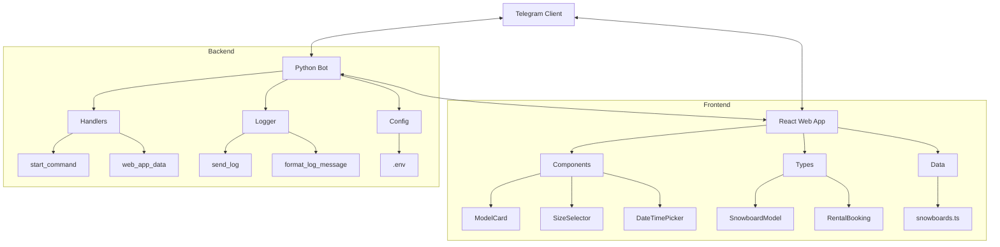
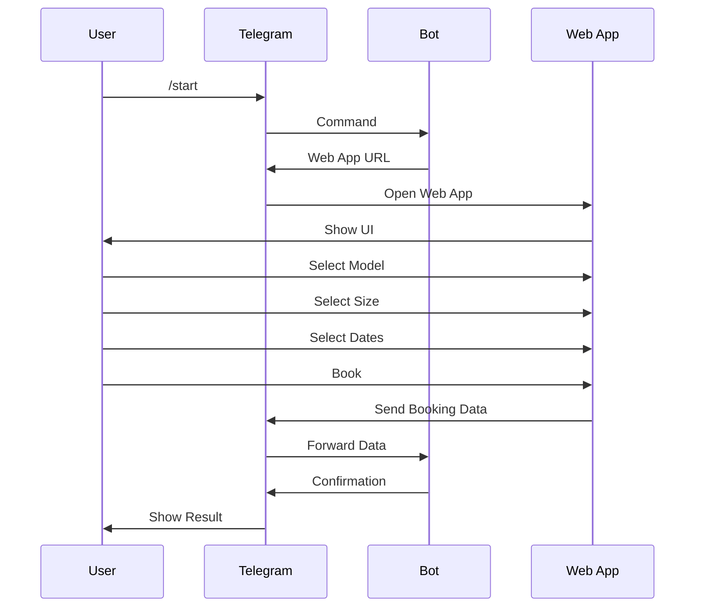

<p align="center">
  <br>
  
  <br>
  <br>
</p>

# Telegram Mini Apps(TMA) + React + TypeScript + Vite

в основе проекта лежит: [vite-boilerplate](https://github.com/twa-dev/vite-boilerplate)

## 🌟 Основные возможности

- Бронирование сноубордов через веб-интерфейс
- Проверка доступности на выбранные даты
- Управление инвентарем для администраторов
- Аудит бронирований
- Интеграция с Google Calendar
- Просмотр и отмена бронирований пользователями
- Система отзывов

## 🛠 Технологии
- Vite - современный инструмент сборки
- React - библиотека для создания пользовательских интерфейсов
- TypeScript - типизированный JavaScript
- @twa-dev/sdk - SDK для работы с Telegram Mini Apps
- Python - backend + bot

## 👥 Роли пользователей

### Обычный пользователь
- Бронирование сноубордов
- Просмотр своих бронирований
- Отмена бронирований
- Оставление отзывов

### Администратор
- Управление инвентарем
- Аудит бронирований

## Архитектура проекта

### Компоненты системы



### Поток данных



## 🤖 Описание кода

### Backend (Python)

- `bot.py`: Основной файл бота с обработчиками команд и сообщений.
    - `start_command`: Обработчик команды /start
    - `handle_contact`: Обработка контактных данных пользователя
    - `handle_web_app_data`: Получение данных из веб-приложения
    - `handle_inventory_command`: Управление инвентарем (для админов)
    - `audit_bookings_command`: Аудит конфликтов в бронированиях
- `inventory_service.py`: Сервис для управления инвентарем.
    - `load_data`: Загрузка данных из JSON файла
    - `is_admin`: Проверка прав администратора
    - `update_quantity`: Обновление количества сноубордов
- `calendar_service.py`: Сервис для работы с Google Calendar.
    - `create_booking_event`: Создание бронирования в календаре
    - `check_availability`: Проверка доступности сноуборда
    - `get_user_bookings`: Получение бронирований пользователя
    - `audit_bookings`: Проверка конфликтов бронирований

### Frontend (React + TypeScript)

- `App.tsx`: Основной компонент приложения с логикой выбора сноуборда и даты.
    - `handleBooking`: Отправка данных бронирования в бота
    - `MainButton`: Обработчик для MainButton Telegram Web App


## 🔄 CI/CD
Для автоматического развертывания настроен GitHub Actions
А также написаны скрипты для автоматической загрузки файлов на сервер и запуска приложения

## Usage 🚀
### ⚙️ Настройка окружения

1. Клонируйте репозиторий:
```bash
git clone https://github.com/username/snowboard-rental-bot.git
cd snowboard-rental-bot
```

2. Переименуйте файл `.public_env` в `.env` и заполните необходимыми данными:
```
BOT_TOKEN=your_telegram_bot_token
WEBAPP_URL=your_webapp_url
STICKER_ID=your_sticker_id
LOG_CHANNEL_ID=your_channel_id
ADMIN_IDS=admin1_id,admin2_id
```

3. Установите зависимости:
```bash
# Backend
cd BotPy
pip install -r requirements.txt
```

4. Получите credentials.json для Google Calendar API:
-  Создайте проект в Google Cloud Console
- Включите Google Calendar API
- Создайте OAuth 2.0 credentials (Desktop application)
- Скачайте файл credentials.json и поместите его в директорию BotPy
- При первом запуске будет выполнена авторизация и создан файл token.json

5. Первый локальный запуск:
```bash
python bot.py
```
в процессе работы будет создан файл token.pickle, который будет использоваться для авторизации в Google Calendar
после регистрации в гугл завершите бот (cntrl+c в терминале)

6. Загрузкат файлов на сервер:
```bash
./upload.sh -t ssh root@ip password
```
далее следуйте инструкциям


### Дополнительно
#### Deploy Frontend (Local)

```bash
# npm
npm install
# npm run dev --host
npm run dev
```
or
```bash
# yarn
yarn
yarn dev --host
```

#### Deploy Backend (Local)

```bash
# install requirements
pip install -r requirements.txt
```
```bash
# run bot
python bot.py
```

#### Deploy as a service (Вручную)

##### Установка зависимостей
```bash
sudo apt-get update
sudo apt-get install -y python3-pip
sudo pip3 install -r requirements.txt
```
```bash
sudo apt-get install -y npm
npm install
```

##### Create a service files
>важно, нужно разместить файлы в /etc/systemd/system/

Frontend (Web App):
```yaml
[Unit]
Description=Snowboard Rental Frontend
After=network.target

[Service]
Type=simple
User=YOUR_USER
WorkingDirectory=/path/to/your/frontend
ExecStart=/usr/bin/npm run preview
Restart=always
Environment=PORT=4173

[Install]
WantedBy=multi-user.target
```

Backend (Telegram Bot):
```yaml
[Unit]
Description=Snowboard Rental Telegram Bot
After=network.target

[Service]
Type=simple
User=YOUR_USER
WorkingDirectory=/path/to/your/BotPy
ExecStart=/usr/bin/python3 bot.py
Restart=always
Environment=PYTHONUNBUFFERED=1

[Install]
WantedBy=multi-user.target
```

##### Enable and start services
```bash
sudo systemctl enable frontend.service && sudo systemctl start frontend.service
```

```bash
sudo systemctl enable backend.service && sudo systemctl start backend.service
```

#### Check status
```bash
sudo systemctl status frontend.service && sudo systemctl status backend.service
```

#### Check logs
```bash
sudo journalctl -u frontend.service -f
```

```bash
sudo journalctl -u backend.service -f
```


# Links

- [Doc](https://docs.ton.org/develop/dapps/twa)
- [Example TMA](https://t.me/vite_twa_example_bot/app)
- [Link](https://twa-dev.github.io/vite-boilerplate/)


# Проблемы
- превышин лемит на создание SSL сертификатов
`An unexpected error occurred:
too many certificates (5) already issued for this exact set of domains in the last 168h0m0s, retry after 2025-02-12 04:13:02 UTC: see https://letsencrypt.org/docs/rate-limits/#new-certificates-per-exact-set-of-hostnames`

ссылка на тему: https://community.letsencrypt.org/t/there-were-too-many-requests-of-a-given-type-error-creating-new-order-too-many-certificates-5-already-issued-for-this-exact-set-of-domains-in-the-last-168-hours/176622/9

https://crt.sh/?q=tgappa.ru